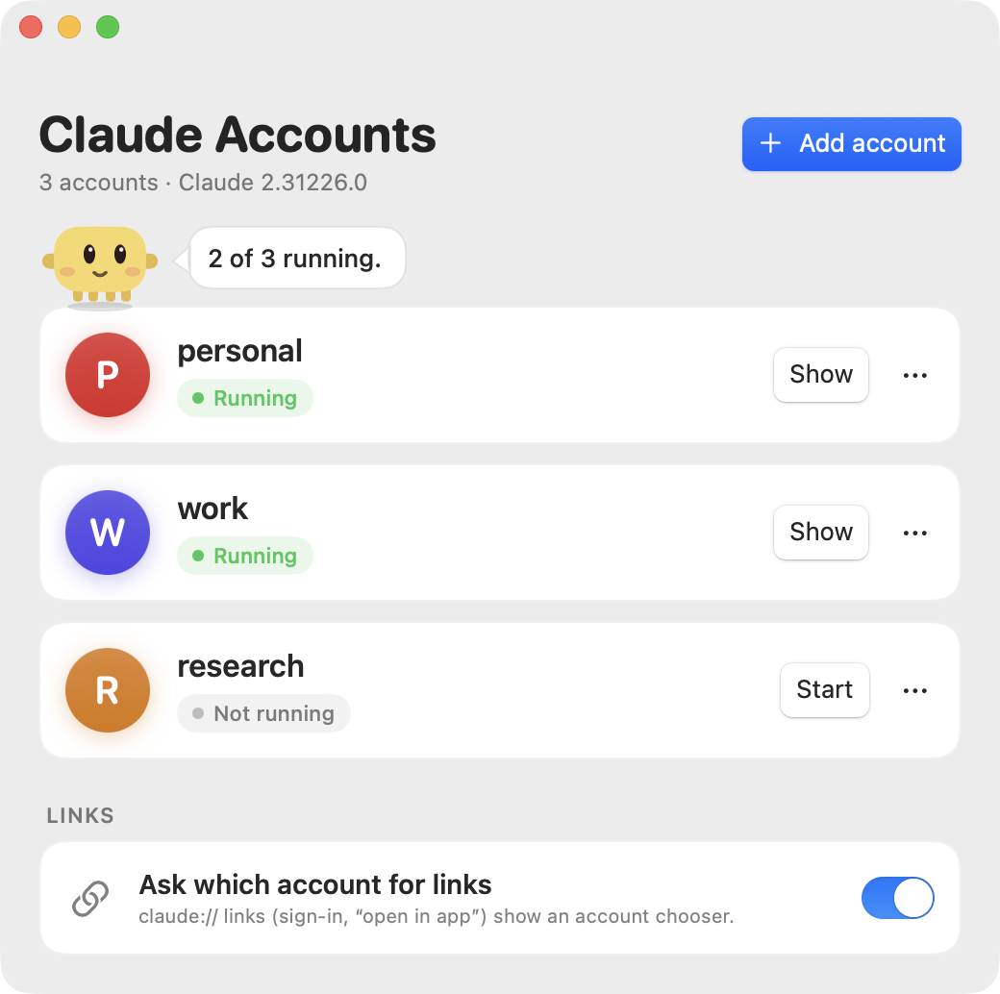

<p align="center">
  
</p>

<h1 align="center">Claude Accounts</h1>

<p align="center">
  Run several Claude desktop accounts side by side on macOS, and send every <code>claude://</code> link to the right one.
</p>

<p align="center">
  
</p>

> Unofficial. Not affiliated with or endorsed by Anthropic. "Claude" is a trademark of Anthropic.

## Why

Claude Desktop has no account switcher. The usual workaround is one `--user-data-dir` per account, but every instance
shares one bundle ID, so macOS hands every `claude://` link (sign-in callbacks, "open in app") to whichever instance it
likes, usually the first one that was started. Sign-ins land in the wrong account and links open in the wrong window.

Claude Accounts fixes that, and gives you a small window to start and manage your accounts.

## Install

1. Download the latest `Claude-Accounts-x.y.z.dmg` from [Releases](../../releases/latest).
2. Open it and drag **Claude Accounts** into Applications. The app is signed and notarized, so it just opens.
3. Start it from Launchpad, Spotlight or Raycast. Your current Claude sign-in becomes the first account; name it.
4. Press **Add account** for each further sign-in, then **Start** it once and sign in.

Requires macOS 13 or later and [Claude Desktop](https://claude.ai/download) in `/Applications`.

## Using it

- **Start / Show**: starts an account, or brings it to the front if it is already running. Every account has its own
  window, its own sign-in and its own data.
- **Ask which account for links**: turn this on and `claude://` links open a small chooser instead of going to a
  random window. If the chosen account is not running, it is started first.
- **Launchers**: the `...` menu of an account can create `Claude <name>.app` in `~/Applications/Claude Accounts`, with
  the Claude icon and a coloured letter badge, for Dock, Spotlight and Raycast.
- **Earlier setups are picked up.** If you already used one `--user-data-dir` folder per account
  (`~/Library/Application Support/Claude-<name>`), the app offers to add each one, sign-in included.
- **Remove account** deletes the account's entry, its copy of Claude and its launcher. Your sign-in data folder
  (`~/Library/Application Support/Claude-<name>`) is never deleted.

## How it works

- **One copy of `Claude.app` per account.** An APFS clone (`cp -Rc`): instant, no extra disk space, and the code
  signature stays valid. The first account keeps using `/Applications/Claude.app`.
- **Each account runs with its own `--user-data-dir`.**
- **Delivery by app path.** `open -a "<that account's copy>" claude://...` reaches the instance running from that path,
  even though all copies share a bundle ID.
- **Claude Accounts owns the `claude://` scheme** while link routing is on. Claude re-registers itself as the handler on
  every start, so a tiny LaunchAgent (`~/Library/LaunchAgents/dev.yannik.claude-accounts.claim.plist`) watches the
  LaunchServices preferences and takes the scheme back, idempotently.

State lives in `~/Library/Application Support/claude-accounts/` (account list `accounts.tsv`, the copies, a log).

## Updates

Claude Accounts updates itself with [Sparkle](https://sparkle-project.org): it checks once a day and offers new
versions in a standard update window. Every update is signed with the project's EdDSA key and notarized by Apple.
You can also use **Claude Accounts > Check for Updates...** in the menu bar.

## Safety

- Never opens one data folder from two processes: it refuses and tells you which launcher already has it.
- Never downgrades a copy. A copy is refreshed to the installed Claude version only while that account is not running.
- Never quits, restarts or touches a running Claude, and never reads or writes Claude's data folders.
- Only `claude://` links are routed.

To switch everything off, turn the link-routing toggle off (this restores Claude as the handler and removes the
LaunchAgent), then delete the app.

## Known limitations

- A copy's own auto-updater could relaunch it without its data folder (it would then open the first account).
- All running windows share Claude's Dock icon. The coloured badges are only on the launcher apps.

## Build from source

```sh
scripts/build-app.sh          # builds build/Claude Accounts.app, ad-hoc signed
open "build/Claude Accounts.app"
```

Needs the Xcode command line tools (Swift 5.9 or later). No third-party dependencies.

## Contributing

Pull requests are welcome: fork, branch, open a PR. `main` is protected, so changes land through reviewed pull
requests. CI builds every PR.

Releases are cut by the maintainer by pushing a `v*` tag; the
[release workflow](.github/workflows/release.yml) builds, signs, notarizes and drafts the GitHub Release.
Publishing the draft is what makes the update visible to installed apps. The release text comes from
`release-notes/<version>.md` (falling back to the commit list) and is used for both the draft and the update window.

## License

[MIT](LICENSE)
